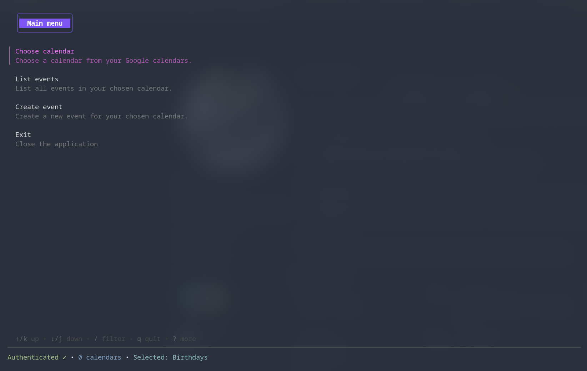
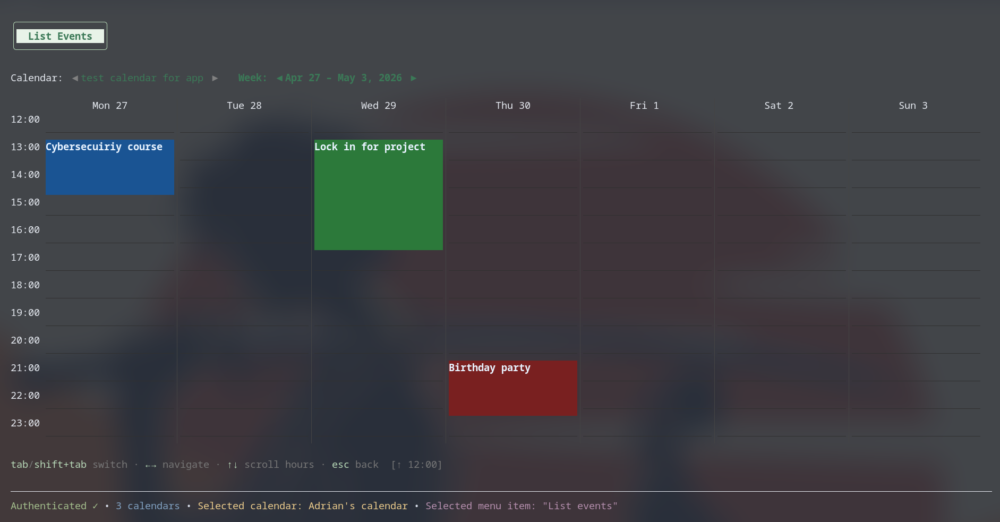
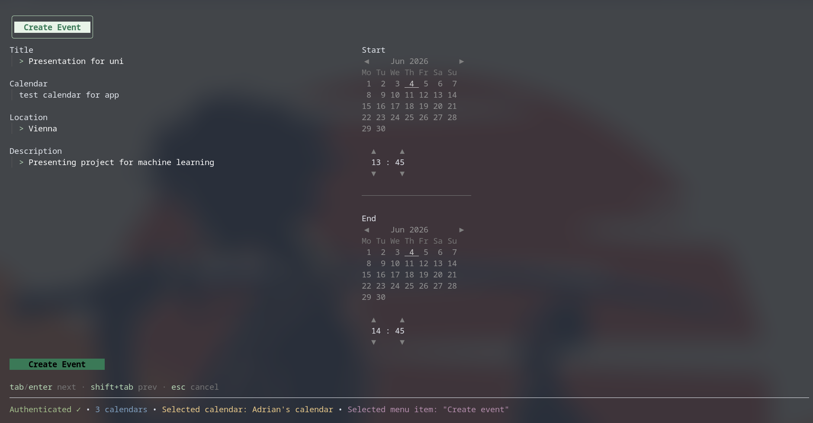

# calendarCLI

A terminal UI for Google Calendar — browse your week, view events, and create new ones without leaving the terminal.

Built with [Bubble Tea](https://github.com/charmbracelet/bubbletea) and [Lip Gloss](https://github.com/charmbracelet/lipgloss).

---

## Screenshots

**Main menu**



**Weekly schedule view**



**Create event**



---

## Features

- Weekly schedule grid — 7-day view with hour-by-hour layout
- Event blocks — each event fills its full time slot with a distinct color; overlapping events split the column side-by-side
- Multi-day events — events crossing midnight or spanning several days appear correctly across all day columns
- Calendar selector — switch between any of your Google calendars on the fly
- Week navigation — jump forward or back one week at a time
- Create events — title, calendar, location, description, start and end date/time pickers all in the terminal
- OAuth2 auth — browser-based sign-in on first run; token cached locally afterwards

---

## Requirements

- Go 1.21+
- A Google account
- A Google Cloud project with the **Google Calendar API** enabled and an OAuth2 desktop client credential

---

## Setup

### 1. Google Cloud credentials

1. Go to [console.cloud.google.com](https://console.cloud.google.com) and create a project (or use an existing one).
2. Enable the **Google Calendar API** for the project.
3. Under **APIs & Services → Credentials**, create an **OAuth 2.0 Client ID** for a *Desktop app*.
4. Download the JSON file and save it as `credentials.json` in the project root.

### 2. Build and run

```bash
# Clone
git clone https://github.com/YOUR_USERNAME/calendarCLI.git
cd calendarCLI

# Build
make build

# Run (opens a browser for OAuth on the first launch)
make run
```

On first run the app prints an auth URL. Open it in a browser, approve access, and the token is saved to `token.json` — you won't be asked again.

---

## Usage

| Screen | Key | Action |
|---|---|---|
| Main menu | `↑ ↓` | Navigate items |
| Main menu | `enter` | Select item |
| Main menu | `q` / `ctrl+c` | Quit |
| List events | `tab` / `shift+tab` | Switch between Calendar and Week sliders |
| List events | `← →` | Cycle calendars or shift week |
| List events | `↑ ↓` | Scroll hours |
| List events | `esc` | Back to main menu |
| Create event | `tab` / `enter` | Next field |
| Create event | `shift+tab` | Previous field |
| Create event | `← →` | Move day (calendar picker) |
| Create event | `↑ ↓` | Move week / change hour or minute |
| Create event | `[ ]` | Previous / next month |
| Create event | `esc` | Cancel |

---

## Project structure

```
cmd/
  main.go              Entry point — wires auth, service, and Bubble Tea
internal/
  auth.go              OAuth2 flow, token caching
  service.go           Google Calendar API client wrapper
  events.go            Event listing and creation
  logger/logger.go     Structured file logger (logs/app.log)
ui/
  app/
    root.go            Root Bubble Tea model, screen router
    mainMenuScreen.go  Main menu
    listEventsScreen.go  Weekly schedule view
    createEventScreen.go  Event creation form
    selectCalendarScreen.go  Calendar picker
    messages.go        Inter-screen Bubble Tea messages
    helpers.go         Shared utilities and navigation handler
  styles/theme.go      Lip Gloss color palette and shared styles
  consts.go            Screen and menu type enums
  helpers.go           Menu item loader
```

---

## License

MIT
